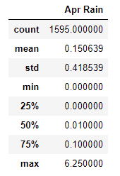

# _Hang Ten !_ || Surf's Up, Local Surf and Ice Cream Shop, Analysis

## Overview of Project 

In looking to open a local surf and ice cream shop, _"Surf's Up"_ on the island of Oahu, a weather analysis was conducted to present to prosepective investors. 

## Resources

* Data Source(s): hawaii.sqlite

* Software / Tools: Visual Studio Code, 1.52. 1 | Python 3.7.6 64-bit  | Python Libaries: Pandas, Numpy | SQLite | SQLAlchemy | Flask | JSONIFY | Jupyter Notebook** 

    * Data Access: Workaround, [Project Jupyter: jupyter nbviewer](https://nbviewer.jupyter.org/), a Jupytner Notebook renderer **
     * Data may not display properly on GitHub, please use provided workaround

   

## Results

 

  <i><b> June and December Temperature Summaries</b></i> 

 

 _*Tobs = Temperatures Observered_

In looking at temperature trends for June and December, we see that:
*   Average high temperatures reached between **71 to 75 degrees** respectively, with a standard deviation of approximately **3 - 4 percent** or **3 - 4 degrees**. 

* December temperatures reached a max of **83 degrees**.

* Out _1517_ temperatures recorded, the "coldest" temperature on record for the month of December is **64 degrees**. 

* Temperatures appear remain rather consistent _all_ year round in the months of December and June.  

## Summary

While the relative warm temperatures would prove the island of Oahu would be an ideal location for _"Surf's Up"_, it was worth looking into the rainfall or precipitation measurements of the former two months: June and December, as well. 

Findings of this review showed precipitation data was quite low, raining less than 1% on average. 

Additionally, as seen in the below summaries, temperatures on average **70- 75 degrees**, with rainfalls of less than 1% on average.  

  

  <i><b> April and October Temperature Summaries</b></i> 

     
    
   _*Tobs = Temperatures Observered_

---
   
  

  <i><b> April and October Rainfall Summaries</b></i> 

    

Previous analysis took data from the winter and summer, but another dive into the spring and fall months of April and October doubled down or confirmed that opening _"Surf's Up"_ will be a success. Primarily, due to the favorable weather conditions. 

#### Author
_Whitney D. Gardner_